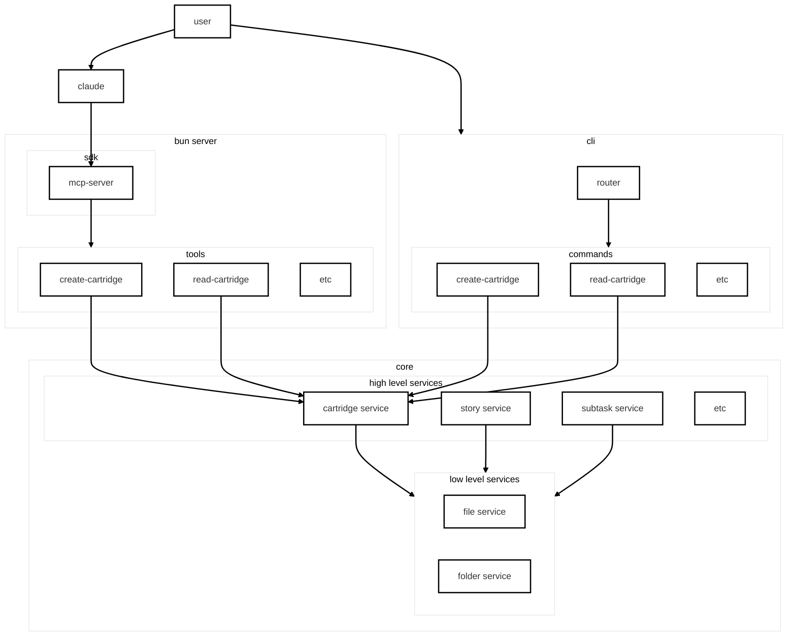

# SWIC Architecture Design

## System Architecture

## Component Overview

### User Interfaces
- **User** - Direct interaction with CLI or through Claude
- **Claude** - AI assistant interface using MCP protocol

### Server Layer (Bun Server)
- **SDK** - MCP server implementation
- **Tools** - MCP tool handlers for object operations

### CLI Layer
- **Router** - Command routing logic
- **Commands** - CLI command implementations

### Core Services

#### High Level Services
- **Cartridge Service** - Manages cartridge operations
- **Story Service** - Manages story lifecycle
- **Subtask Service** - Handles subtask operations
- **Additional Services** - Other domain-specific services

#### Low Level Services
- **File Service** - File system operations
- **Folder Service** - Directory management

## Data Flow

1. Users interact either directly through CLI commands or via Claude
2. Claude communicates through the MCP server protocol
3. MCP server exposes tools that call into high-level services
4. CLI commands also call the same high-level services
5. High-level services use low-level services for persistence
6. All operations maintain versioning and audit trails